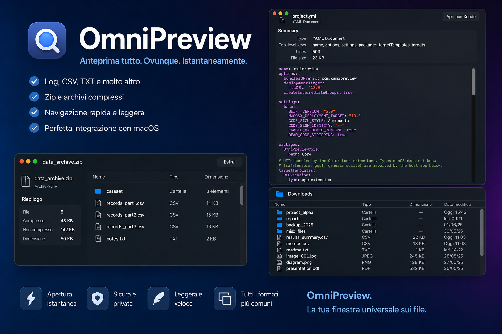

# OmniPreview

### The Ultimate Quick Look Extension for macOS



OmniPreview transforms Quick Look into a powerful universal file explorer, bringing rich previews, syntax-highlighted source code, structured metadata inspection, and interactive 3D viewers to hundreds of file formats that macOS cannot preview natively.

Built entirely in Swift with zero third-party runtime dependencies, OmniPreview feels like a natural extension of macOS. Press Space in Finder and instantly explore archives, databases, AI models, 3D assets, scientific datasets, source code with full syntax highlighting, rendered Markdown, and much more — without launching another application.

**📋 [Complete Supported File Format List](SUPPORTED_FORMATS.md)** — 29+ file families with test coverage status, Free/Pro tiers, and system precedence notes.

## Latest Update (June 2026)

- **Image metadata visibility hardened**: image previews now keep the metadata panel visible even when some ImageIO properties are partially unavailable.
- **Video metadata loading hardened**: media metadata loading is now defensive (duration/tracks/tags loaded independently) to avoid empty/failed previews on edge-case containers.
- **INI/CFG handling improved**: broader config extension support (`.ini`, `.cfg`, `.conf`, `.cnf`, `.properties`, `.editorconfig`, `gitconfig`) and smarter parser behavior (BOM, comments, multiline continuations).
- **Extensionless text detection improved**: files without extension are now recognized more reliably as text (including UTF BOM/UTF-16 patterns), reducing false negatives.

---

## Why OmniPreview?

Quick Look is one of macOS's most beloved features, but hundreds of modern file formats still appear as generic icons or plain unformatted text. OmniPreview fills that gap with fast, secure, read-only previews for over 100 file formats through a modular renderer plugin architecture.

### Key Features

- **29 renderer plugins** covering 100+ file formats — **17 Free, 12 Pro**
- **Syntax-highlighted source code** for 50+ languages — Swift, Python, TypeScript, Go, Rust, Kotlin, JSON, XML, YAML, SQL, and many more
- **Rendered Markdown** — headings, code blocks with highlighting, tables, lists, blockquotes
- **Finder-style folder and archive browser** — expand/collapse tree with Name, Kind, Size and Date Modified columns, file type icons, relative dates (Today at 14:32, Yesterday…)
- **Interactive 3D viewer** — rotate and zoom STL, OBJ, PLY and USDZ models with SceneKit
- **Image annotation editor** — pen, line, rectangle, text tools with PNG export at native resolution
- Built entirely with native Apple frameworks — SwiftUI, AppKit, SceneKit, ModelIO, AVFoundation, PDFKit, CoreText, ImageIO
- Zero third-party runtime dependencies
- Apple Silicon optimized, Intel supported
- Native Dark and Light Mode
- Sandboxed Quick Look extensions
- Low memory footprint — read-only rendering pipeline

---

## Free vs Pro

OmniPreview is useful out of the box. The free tier covers every essential developer workflow. **Pro** unlocks the high-value analysis features for ML engineers, data scientists, 3D artists and creative professionals.

| Feature | Free | Pro |
|---|:---:|:---:|
| ZIP, TAR, Gzip/XZ full contents listing | ✓ | |
| 7z, RAR, ISO, DMG, DEB, RPM, PKG… metadata | ✓ | |
| SQLite schema & row counts | ✓ | |
| PDF metadata & bookmarks | ✓ | |
| Source code — plain text (50+ languages detected) | ✓ | |
| Source code — **syntax highlighting with colors** | | ✓ |
| Markdown — raw source | ✓ | |
| Markdown — **formatted rendering** (headings, tables, code blocks) | | ✓ |
| Folder browser (Finder-style columns, disclosure tree) | ✓ | |
| Images — dimensions, EXIF, AI generation metadata (ComfyUI / A1111) | ✓ | |
| Fonts — specimen & metadata | ✓ | |
| X.509 certificates | ✓ | |
| INI / YAML / JSON / TOML structured view | ✓ | |
| GIS — GeoJSON, KML, Shapefile | ✓ | |
| Torrents — full file list | ✓ | |
| Database dumps & Terraform state | ✓ | |
| CAD — DXF, STEP, DWG, IGES | ✓ | |
| Image annotation editor (pen, line, rectangle, text, PNG export) | ✓ | |
| **eBooks — EPUB with cover, MOBI, AZW3, FB2, CBZ** | | ✓ |
| **Audio & Video — codecs, resolution, bitrate, tags** | | ✓ |
| **3D models — interactive SceneKit viewer** | | ✓ |
| **GGUF / LLM models** | | ✓ |
| **Safetensors models** | | ✓ |
| **ONNX models** | | ✓ |
| **NumPy arrays & NPZ archives** | | ✓ |
| **App packages — JAR, APK, IPA, PyTorch** | | ✓ |
| **Scientific data — Parquet, HDF5, FITS, NetCDF, MATLAB** | | ✓ |
| **VM disk images — QCOW2, VMDK, VHDX** | | ✓ |
| **GPU textures — QOI, DDS, TGA, KTX/KTX2, HDR** | | ✓ |

**[Get OmniPreview Pro →](https://invernomuto2.gumroad.com/l/lghiqc)**

After purchase, enter your license key in **OmniPreview → Settings → License**.

---

## Explore Archive Contents Instantly

Preview archive structures without extracting a single file. Zip bombs and archive bombs are structurally safe: archive listings are parsed from directory structures only — compressed data is never inflated.

| Format | Preview |
|---|---|
| ZIP | File tree, sizes, compression ratio, modification dates — central directory only, no extraction |
| TAR | File tree with sizes and dates, GNU long-name support |
| TAR.GZ / TGZ | Full contents listing via bounded decompression |
| TAR.XZ / TXZ | Full contents listing via bounded decompression |
| Gzip, XZ, BZip2 | Header metadata: original filename, date, producing OS |
| 7-Zip | Version, size metadata |
| RAR | Format version metadata |
| ISO | Volume name, publisher, image size |
| DMG | Partition listing from UDIF XML plist, uncompressed size |
| DEB / ar | Full member listing |
| RPM | Package name and type |
| PKG (xar) | Package metadata |
| MSI / CFB | Container identification |
| CAB | File count, folder count, declared size |

---

## Documents and eBooks

| Format | Preview |
|---|---|
| PDF | Page count and sizes, document info, bookmarks, encryption status |
| ODT, ODS, ODP | Title, author, modification date, statistics |
| EPUB | Cover image, title, author, language, spine count |
| MOBI, AZW3 | Title, database name, record count |
| FB2 | Title, author, genre, language |
| CBZ | Cover image and page count |
| CBR | Archive metadata |

---

## Source Code and Developer Files

Full syntax highlighting for 50+ languages, rendered directly inside Quick Look with color-adaptive themes (dark and light mode):

**Systems languages** — Swift, Objective-C, C, C++, Rust, Go, Java, Kotlin, C#, Scala, Dart  
**Scripting** — Python, Ruby, PHP, Lua, Shell/Bash/Zsh, Fish, Elixir, Crystal, Nim, R, Julia  
**Web** — JavaScript, TypeScript, HTML, CSS, SCSS/Sass  
**Data and config** — JSON, XML, YAML, TOML, INI/CFG, SQL, GraphQL, Terraform HCL, Nix  
**Docs** — Markdown with full block-level rendering: headings, code blocks, tables, lists, blockquotes  

Syntax token colors:

| Token | Color |
|---|---|
| Keywords | Purple |
| Strings | Red |
| Comments | Green |
| Numbers | Blue |
| Types (PascalCase) | Cyan |
| Functions | Orange |
| JSON/YAML keys | Purple |
| XML/HTML tags | Green |
| Attributes | Teal |

YAML files get additional structure detection: **Kubernetes manifests** (kind, name, namespace, images), **Docker Compose** (services, images, volumes), **GitHub Actions** workflows (jobs, steps).

---

## Images and AI Workflows

| Format | Preview |
|---|---|
| PSD, PSB | Photoshop document metadata |
| EXR | High dynamic range image metadata |
| JPEG XL | JXL image metadata |
| Camera RAW (CR2, CR3, NEF, ARW, RAF, ORF, RW2, PEF, DNG) | Embedded JPEG preview + full EXIF: camera, lens, focal length, aperture, shutter, ISO, date |
| PNG with ComfyUI metadata | **Prompt, model, LoRA, sampler, seed, CFG, scheduler, node count** from embedded workflow JSON |
| PNG with Automatic1111 / Forge metadata | **Positive prompt, negative prompt, steps, sampler, CFG, seed** and all generation parameters |
| QOI, DDS, TGA, KTX, KTX2, Radiance HDR | Texture dimensions, format, mip levels |

---

## Databases and Scientific Data

| Format | Preview |
|---|---|
| SQLite | Schema overview, table list, column and row counts (read-only, `immutable=1`) |
| PostgreSQL dump (plain + custom) | Table list, statement counts, dump version |
| MySQL dump | Table list, statement counts |
| Parquet | Footer metadata, size |
| Apache Arrow | Container identification |
| DuckDB | Storage version |
| HDF5 | Superblock version |
| NetCDF | Format version, dimension list |
| MATLAB (.mat) | Header description, MAT version |
| FITS | Header card values: BITPIX, NAXIS, dimensions, telescope, instrument, object |

---

## AI and Machine Learning

| Format | Preview |
|---|---|
| Safetensors | Tensor names, dtypes, shapes, total parameter count, embedded `__metadata__` |
| GGUF | Architecture, GGUF version, tensor count, all metadata key-values including tokenizer entries |
| ONNX | Producer name and version, IR version, domain — via minimal protobuf field walk |
| NPY | Data type, shape, element count, memory order (C / Fortran) |
| NPZ | Per-array dtype, shape and name table |
| PyTorch checkpoint (.pt, .pth) | Tensor storage count and total data size |

---

## 3D, CAD and GIS

OmniPreview is useful out of the box. The table below follows a strict policy:

- listed in **Free/Pro** = tested and currently reliable
- not fully test-covered or not consistently guaranteed in Finder = moved to **Work in Progress**
|---|---|
| STL, OBJ, PLY, USDZ | **Interactive SceneKit viewer** — rotate, zoom, orbit with mouse/trackpad — plus geometry statistics |
| GLB, glTF | Node, mesh, material, animation, texture counts; generator and version |
| ZIP, TAR, Gzip/TGZ listing | ✓ | |
| DMG + archive metadata families (7z/RAR/ISO/DEB/RPM/PKG/CAB/MSI/CFB) | ✓ | |
| STEP | Model name, AP schema, entity count |
| GeoJSON | Feature count by geometry type, property keys, bounding box |
| **Color & Formatting** — syntax highlighting + formatted Markdown | | ✓ |
| Shapefile | Shape type, bounding box |
---

| INI/CFG + YAML structured view | ✓ | |
| Torrent + Terraform state | ✓ | |
| GGUF / Safetensors / NPY / NPZ inspection | | ✓ |
| QOI texture + QCOW2 metadata paths | | ✓ |

### Work in Progress (implemented or partial, not guaranteed yet)

- Video and common image preview paths in Finder (macOS default Quick Look can take precedence; e.g. `.mp4`)
- Office/eBook advanced workflows
- ONNX, scientific datasets, full app/package matrix
- Extended 3D/CAD/GIS/media matrices not yet fully promoted as guaranteed product promises

### Transparency note

For some Apple-native file families (especially media/images/documents), OmniPreview may support parsing in code while Finder still shows the default macOS preview depending on UTI precedence and system policy.
- File type icons (folders in accent color, files by type)
- Relative dates — "Today at 14:32", "Yesterday at 09:15", weekday name within the last week
- Status bar with item count

---

## Image Annotation Editor

Drop an image into the OmniPreview app window and click **Annotate** in the toolbar to open the markup editor:

- **Pen** — freehand drawing
- **Line** — straight lines
- **Rectangle** — bounding boxes and highlights
- **Text** — labels placed with a click

Controls: color picker, stroke width slider, undo, clear all. Annotations are stored in normalized coordinates and exported via **Save PNG…** at the image's native pixel resolution.

---

## Security

OmniPreview is built on a security-first architecture:

- **Never executes file contents.** No scripts, no code evaluation, no plug-in execution.
- **Archives are listed, not extracted.** ZIP central directories are parsed; compressed data is never inflated, making zip bombs structurally harmless.
- **Bounded parsing everywhere.** Every binary parser has hard caps on header sizes, entry counts, string lengths and decompression output — hostile or malformed files produce a clean error, not a crash or memory exhaustion.
- **Sandboxed extensions.** Both Quick Look extensions run in the App Sandbox with no network access and read-only access to the previewed file.
- **Read-only SQLite access** via `immutable=1` URI flag — no WAL/SHM files created.

---

## Requirements

- macOS 13 Ventura or later
- [XcodeGen](https://github.com/yonaskolb/XcodeGen): `brew install xcodegen`
- Xcode 15+ (developed against Xcode 26)

---

## Install (Pre-built DMG)

1. Download `OmniPreview-macOS.dmg` from the [latest release](https://github.com/Invernomut0/QuickLookWithSteroids/releases/latest)
2. Open the DMG and drag **OmniPreview** to your Applications folder
3. Launch OmniPreview from Applications

### macOS security prompt ("app can't be opened")

Because OmniPreview is distributed outside the Mac App Store, macOS may block the first launch. Fix it with one of these methods:

**Option A — Double-click `Fix Permissions.command`** (included in the DMG)
> A dialog appears asking for confirmation, then your password. Done in 10 seconds.

**Option B — Terminal**
```bash
sudo xattr -cr /Applications/OmniPreview.app
```

**Option C — System Settings**
> System Settings → Privacy & Security → scroll down → click **Open Anyway**

### Enable Quick Look extensions

After the first launch:

**System Settings → Privacy & Security → Extensions → Quick Look**
→ enable both **OmniPreview Preview** and **OmniPreview Thumbnails**

Then reset the Quick Look cache:

```bash
qlmanage -r && qlmanage -r cache
```

Press Space on any supported file in Finder. OmniPreview runs as a **menu bar agent** (eye icon) — no Dock icon, no Command-Tab entry.

---

## Build from Source

```bash
git clone https://github.com/Invernomut0/QuickLookWithSteroids.git
cd QuickLookWithSteroids

scripts/build.sh                    # generate xcodeproj and compile
open build/Build/Products/Debug/OmniPreview.app
```

---

## Run the Test Suite

```bash
scripts/test.sh        # swift test inside Core/
```

### Sample corpus for broad format testing

A curated fixture set is now included at:

`samples/format-fixtures/`

It contains ready-to-open examples for source/config/data/security/geo families and placeholders for binary-heavy families (media, archives, 3D, disk images, ML artifacts) that can be replaced with real files during manual QA.

---

## Repository Layout

```
Core/                         Swift package — all preview logic and SwiftUI views
  Sources/OmniPreviewCore/
    Detection/                Magic-byte + extension-based file detection (50+ signatures)
    Plugins/                  PreviewRenderer protocol, registry, document model
    Renderers/                29 renderer plugins, one file per format family
    Caching/                  Pipeline with content-identity memory cache
    Support/                  DataReader, Decompressor, ZIPArchive, Format helpers
  Sources/OmniPreviewUI/
    PreviewDocumentView.swift  Main SwiftUI renderer (sections → views)
    FolderPreviewView          Finder-style tree (shared by folders + archives)
    SyntaxHighlighter.swift    Token-based highlighter for 50+ languages
    CodeView.swift             NSTextView wrapper for highlighted code
    MarkdownView.swift         Block-level Markdown renderer with code blocks
App/                          Menu bar agent (LSUIElement), annotation editor
PreviewExtension/             Quick Look preview extension (Space bar)
ThumbnailExtension/           Quick Look thumbnail extension (Finder icons)
project.yml                   XcodeGen definition (xcodeproj is generated, not committed)
scripts/                      build.sh, test.sh, generate.sh
samples/                      fixture corpus for manual/comprehensive format checks
```

## Pro Feature Notes

Pro-only capabilities remain focused on high-value analysis and rich rendering workflows:

- Syntax highlighting (50+ languages)
- Formatted Markdown rendering
- Video trim & export workflow
- ML model deep inspection (GGUF, Safetensors, ONNX, NumPy/NPZ)
- Office/eBook/media/scientific/3D/texture/disk-image advanced previews

Recent robustness improvements also benefit Pro media workflows by improving metadata extraction reliability on non-ideal containers.

---

## Roadmap

Coming soon:

- **TAR.GZ/XZ contents** — bounded decompression listing (infrastructure already in place)
- **RAR/7z contents** — requires libarchive integration
- **ZIP64** support
- **Syntax highlighting** for more niche languages
- **Waveform view** for audio files
- **MapKit preview** for GIS files (GeoJSON, KML)
- **Git repository preview** — branches, commits, contributors
- **Disk cache** for rendered previews
- **App Group sharing** — plugin enable/disable synced to the QL extensions
- **Notarization workflow** and App Store feasibility

---

## IDE Setup (VS Code / SourceKit-LSP)

The Swift package lives in `Core/`. Add [.vscode/settings.json](.vscode/settings.json) which enables `swift.searchSubfoldersForPackages`. For the Xcode project targets (App, extensions), install the build server:

```bash
brew install xcode-build-server
xcode-build-server config -project OmniPreview.xcodeproj -scheme OmniPreview
```

`buildServer.json` is machine-specific and gitignored. Without it, SourceKit-LSP reports phantom "Cannot find type in scope" diagnostics in `App/` and the extension sources — even though the build succeeds.
